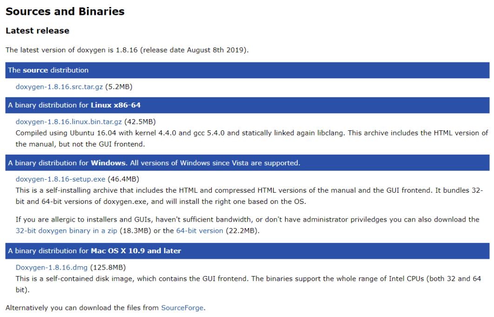
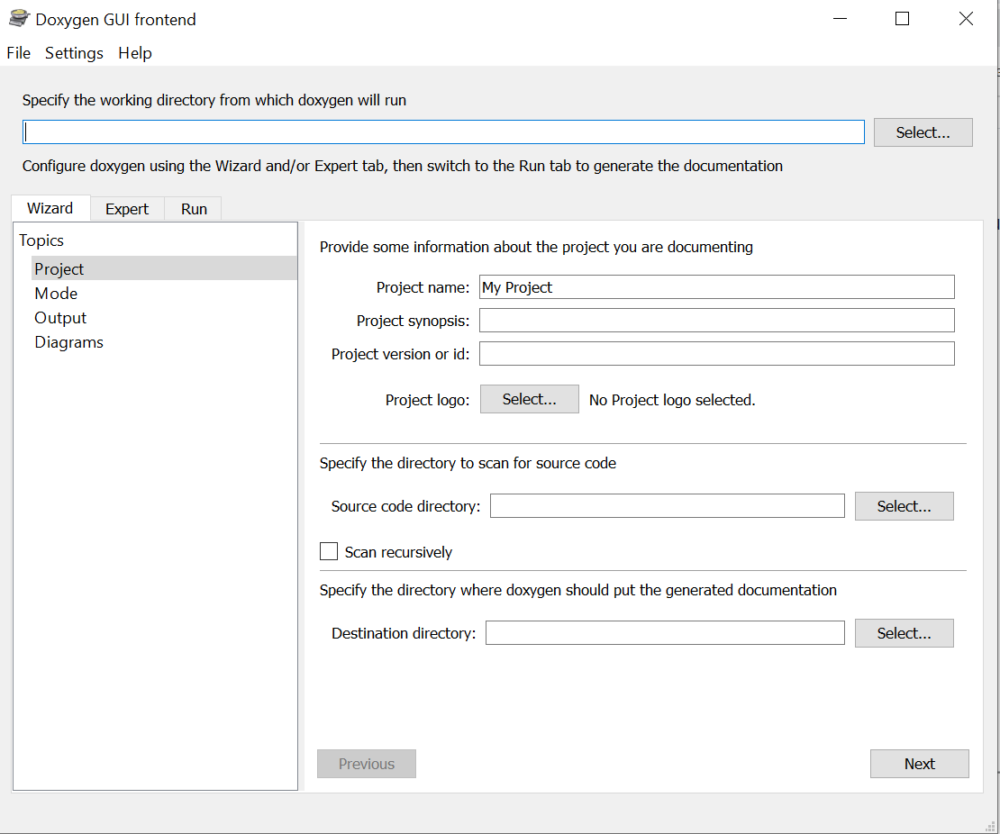
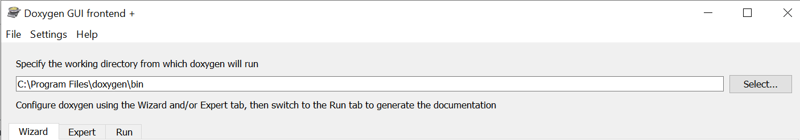
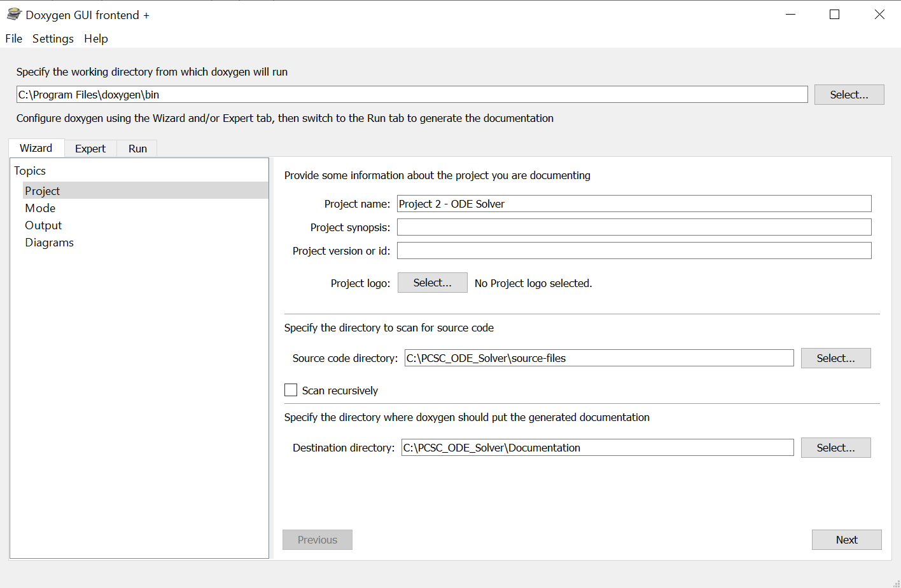
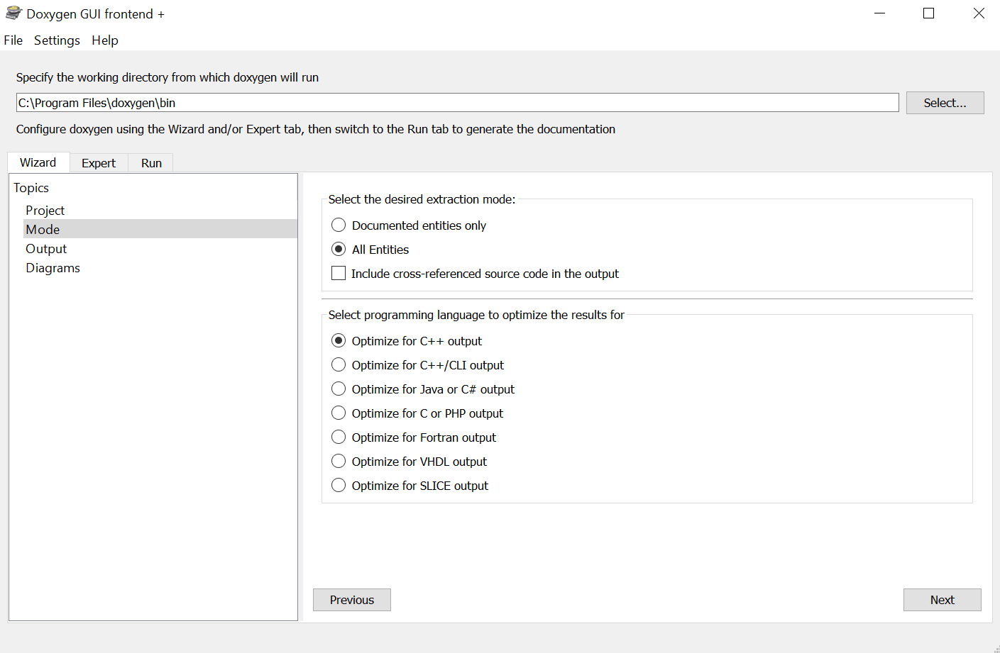
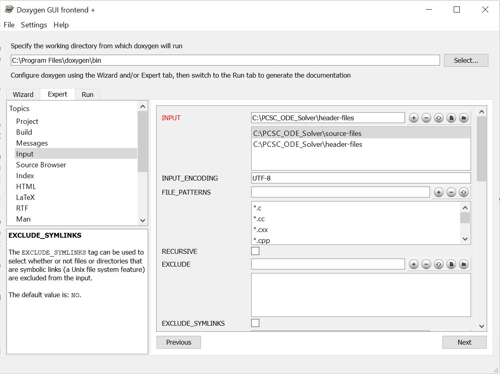

# PCSC_ODE_Solver
In this repository we provide implementation of the ODE solver for the Project 2: "Ordinary Differential Equations" of the class Programming Concepts in Scientific Computing, MATH-458 <br/>
_Authors: Driever Leonhard Xaver, Anna Paulish_

## Table of content
- [the description of the project task](#Introduction)
- [the code structure](#code_structure)
- [hierarchy of classes](#classes_hierarchy)
- [how to run the code](#run)
- [how to generate the documentation](#Documentation)
- [how to test the code](#Tests)


# <a name="Introduction"></a>  Introduction
This project focuses on implementation of numerical methods for solving ordinary differential equations (ODEs) with a given initial value.
<br/> <p align="center"> &space;\quad&space;y(t_0)=y_0) 
</p> <br/>

We consider the following numerical methods:
- explicit methods: Forward Euler and the multistep Adams Bashforth (up to 4 steps);
- implicit Backward Euler method;
- explicit Runge-Kutta method.

# <a name="code_structure"></a> The code structure
- `CMakeLists.txt`: the main executable file is main.cpp
- `header-files\` folder contains all header files
- `sourse-files\` folder contains all source files
- `settings.txt` file contains all initial parameters of ODE
- `output.txt` file contains the solution of the ODE after running the program

<br/>


# <a name="classes_hierarchy"></a> Structure of classes 


# <a name="Requirements"></a> Requirements
1. Eigen library can be downloaded from [here](https://eigen.tuxfamily.org/index.php?title=Main_Page)
   - copy Eigen/ subdirectory to the project directory
2. GoogleTest can be downloaded from [here](https://github.com/google/googletest)
   - create an epmty folder `Google_tests/` and extract the contents of googletest-master there
3. Doxygen can be installed from [here](https://www.doxygen.nl/download.html)
   - more details on how to customize the documentation can be found [below](#Documentation)


# <a name="run"></a> Running the code from CLion

First clone the repo to your preferred location:

```
git clone https://github.com/ldriever/PCSC_ODE_Solver.git
```

Make sure that the `settings.txt` file contains correct input parameters.
<br/>

Then youneed to select the executable `ODE` file and run it.

# Running the code from the Command Line
1. From a terminal window, change to the `cmake-build-debug\` folder in project directory.
2. Paste the following commands 

``` 
cmake ..
make
```
3. To run the project paste:

``` 
./ODE 
```


### Input parameters
In order to solve an ordinary differential equation, you need to determine all the initial parameters using `settings.txt` file with the following values:
- `method_name` - a string variable without quotation marks contains the name of method. You have several options to define it:
ForwardEuler (for Forward Euler method), AdamsBashforth_2, AdamsBashforth_3, AdamsBashforth_4, RungeKutta or BackwardEuler.
- `t_0` - a double variable for initial time: 0.0 as a default
- `y_0` - a double variable for initial y value: 1.0 as a default
- `N` - an integer variable for total number of time steps: 10 as a default
- `dt` - a double variable for the time step size: 0.01 as a default
- `sampling_frequency` - an integer variable to shorten the output. For example, you can output every third element of the solution (in this case sampling_frequency = 3). Define sampling_frequency = 1 to show the entire solution: 1 as a default
- `polynomial_degree` - an integer variable for the degree of the polynomial on the right side of the equation: 1 as a default
- `poly_coefs` - integers separated by spaces for the coefficients of the polynomial on the right side of the equation starting from degree zero: 1 2 3 as a default. <br/>
The default settings correspond to: 
&space;=&space;1\cdot&space;y^{0}&plus;2\cdot&space;y^{1}&plus;3&space;\cdot&space;y^{2})
- `console_output` - an integer variable which indicates whether to output the solution to the console. If equal to 0 - no output in the console, 1 - solution will be printed in the console. Equal to 1 by default.
- `output_path` - a string variable without quotation marks contains the name of the output file with the solution of ODE. As a default: output.txt


### Solution
After executing the program, the solution to the ordinary differential equation will be written to the file specified by the user in `settings.txt`: it is `output.txt` by default.

# <a name="Documentation"></a> Documentation

To create documentation by yourself follow the instructions below.
1. Install __doxygen__ from [here](https://www.doxygen.nl/download.html). Scroll down to the section “Sources and Binaries” and download the version that has support for your particular operating system, be it Linux or Mac or Windows.
<p align="center">  </p>

2. Open __doxywizard__ which is a GUI front-end for configuring and running doxygen.
<p align="center">  </p>
<br/>
3. Specify the working directory from which doxygen will run using the Select... button. <br/><br/>
 <p align="center">  </p> <br/> <br/>

In the Wizard tab you need to modify next fields:
###### Project field

- Project name: Project 2 - ODE Solver (for example)
- Source location: Here you need to enter the path to `sourse-files\` folder
- Destination location: Here you can enter the folder in which you want to save the documentation generated by Doxygen. For example, in the project directory you can create a folder for documentation `PCSC_ODE_Solver\Documentation\`. <br/><br/>
     <p align="center">  </p>
   
###### Mode field

- Extraction mode: _All Entities_ or _Documented entities only_
- Programming Language: _Optimize for C++ output_
<br/>
<p align="center">  </p>
<br/>

In the Expert tab in the __Input__ field you need to specify the `header-files\` directory.
<br/>
<p align="center">  </p>
<br/>
4. Finally in the Run tab, you can click the "Run doxygen" button and then the "Show HTML output" to see the HTML results.
<br/>
<p align="center">  </p>
<br/>

# Tests
