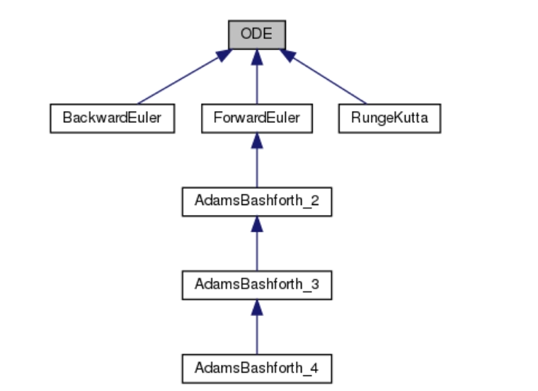
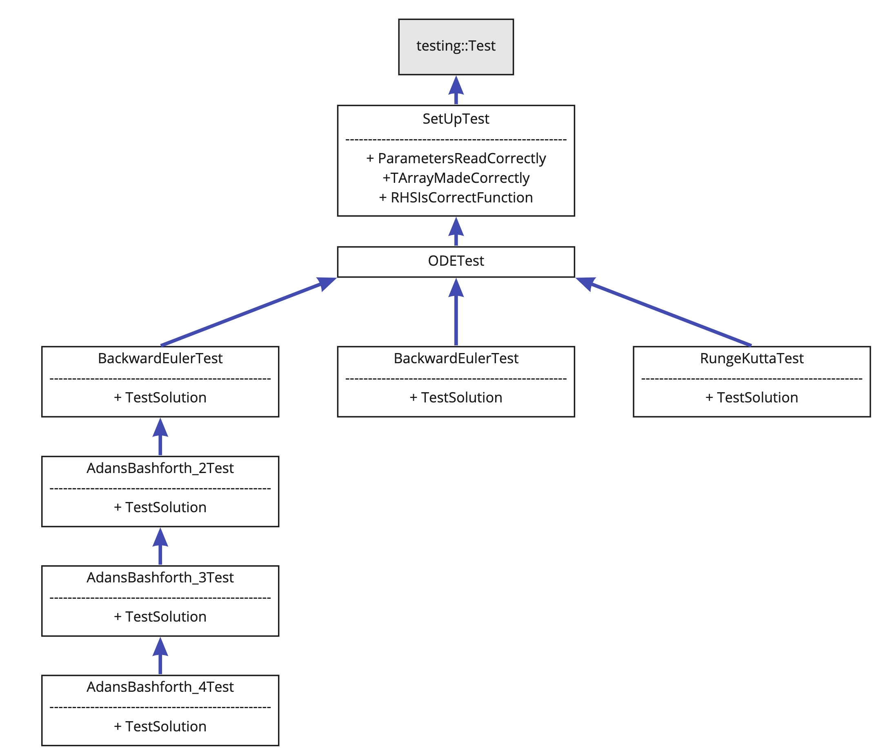

# PCSC_ODE_Solver
In this repository we provide the implementation of the ODE solver for the Project 2: "Ordinary Differential Equations" of the 
class Programming Concepts in Scientific Computing, MATH-458 <br/>
_Authors: Leonhard Xaver Driever, Anna Paulish_

## Table of contents
- [the description of the project task](#Introduction)
- [the code structure](#code_structure)
- [hierarchy of classes](#classes_hierarchy)
- [setting up the project on your computer](#setup)
- [how to run the code with CLion](#run)
- [how to run the code with Command Line](#run_CL)
- [how to generate the documentation](#Documentation)
- [how to test the code](#Tests)
- [perspectives](#outlook)


# <a name="Introduction"></a>  Introduction
This project focuses on implementation of numerical methods for solving ordinary differential equations (ODEs) with a given initial value.
<br/> <p align="center"> 
   
</p> <br/>

We consider the following numerical methods:
- explicit methods: Forward Euler and the multistep Adams Bashforth (up to 4 steps);
- implicit Backward Euler method;
- explicit Runge-Kutta method.

# <a name="code_structure"></a> The code structure
- `CMakeLists.txt`: the main executable file is ODE
- `header-files\` folder contains all header files
- `sourse-files\` folder contains all source files
- `settings.txt` file contains all initial parameters of ODE. Allows the user to change inputs without recompiling the code
- `output.txt` file contains the solution of the ODE after running the program

<br/>

### Input parameters

In order to solve an ordinary differential equation, you need to determine all the initial parameters using `settings.txt` file with the following values:
- `method_name` - a string variable without quotation marks contains the name of method. You have several options to define it:
ForwardEuler (for Forward Euler method), AdamsBashforth_2, AdamsBashforth_3, AdamsBashforth_4, RungeKutta or BackwardEuler.
- `t_0` - a double variable for initial time: 0.0 as a default
- `y_0` - a double variable for initial y value: 1.0 as a default
- `N` - an integer variable for total number of time steps: 10 as a default
- `dt` - a double variable for the time step size: 0.01 as a default
- `sampling_frequency` - an integer variable to shorten the output. For example, you can output every third element of the solution (in this case sampling_frequency = 3). Define sampling_frequency = 1 to show the entire solution: 1 as a default
- `polynomial_degree` - an integer variable for the degree of the polynomial on the right side of the equation: 2 as a default
- `poly_coefs` - integers separated by spaces for the coefficients of the polynomial on the right side of the equation starting from degree zero: 1 2 3 as a default. <br/>
The default settings correspond to: 

- `console_output` - an integer variable which indicates whether to output the solution to the console. If equal to 0 - no output in the console, 1 - solution will be printed in the console. Equal to 1 by default.
- `output_path` - a string variable without quotation marks contains the name of the output file with the solution of ODE. As a default: _output.txt_


### Solution
After executing the program, the solution of the ordinary differential equation will be written to the screen or to the file specified by the user in _settings.txt_

# <a name="classes_hierarchy"></a> Structure of classes 

In total there are three top level classes: SetUp, ODE, and Output. The ODE class furthermore has a set of daughter classes, one for each of the considered numerical methods.
As the family of Adams-Bashforth methods (which also includes Forward Euler) use the lower-order variants of the same family for initializing the first
steps of the solution, these methods inherit from one another. This class inheritence for the ODE class and subsequent methods is shown below.

<div style="width:600px">


</div>

# <a name="setup"></a> Project Setup
Please follow the following steps in order to set up the code on your computer.

### Step 1: Cloning the GitHub repository

Clone the repository to your preferred location using the following command:

```
git clone https://github.com/ldriever/PCSC_ODE_Solver.git
```

### Step 2: Creating auxilliary directories

In the cloned directory `PCSC_ODE_Solver` create the following two empty directories (beware of lower and upper case). 
IMPORTANT: only create the *cmake-build-debug* directory if you want to run the code from the command line. Do not create that directory
if you want to run the code using CLion. In that case CLion will auto-create the directory itself.

- cmake-build-debug (not if using CLion)
- Documentation

### Step 3: Installing the necessary dependencies

In order to run this code, the following three dependencies must be installed in the specified ways.

1. Eigen library can be downloaded from [here](https://eigen.tuxfamily.org/index.php?title=Main_Page)
   - Download the Eigen library as a zip folder. Once downloaded, unzip the folder and move the directory into the project directory. Then rename the Eigen directory (for example it may be called *eigen-3.4.0*) to *eigen* (make sure that it is lower case)
2. GoogleTest can be downloaded from [here](https://github.com/google/googletest)
   - Download GoogleTest as a zip folder. Once downloaded, unzip the folder and move the directory into the project directory. Then rename the GoogleTest directory (for example it may be called *googletest-main*) to *Google_tests* (again make sure to consider capitalization)
3. doxygen can be installed from [here](https://www.doxygen.nl/download.html)
   - doxygen is not necessary for running the code itself, but should be installed in order to see the documentation for the code. Please follow the detailed steps explained in the [documentation section](#Documentation)

# <a name="run"></a> Running the code in CLion

1. Ensure that all dependencies have been installed as described previously.
2. Make sure that there is no existing empty directory *cmake-build-debug*, then open the project in CLion

3. Make sure that the `settings.txt` file contains correct input parameters.

4. Select the executable `ODE` and run it.

5. If the name for the output file was specified (i.e. is not *None*) the output file under that name can now be found in the project directory

# <a name="run_CL"></a> Running the code from the Command Line

1. Ensure that all dependencies have been installed as described previously.
2. Make sure that the `settings.txt` file contains correct input parameters.
3. If it does not yet exist, create a directory called `cmake-build-debug` in the cloned project directory
4. From a terminal window, change to the `cmake-build-debug\` folder in project directory.
- If an error such as `cmake: command not found` appears, install cmake. Instructions for how to do this can be found [online](https://cmake.org/install/)
5. Paste the following commands:

``` 
cmake ..
make
```
6. To run the project use the command:

``` 
./ODE 
```

7. If the name for the output file was specified (i.e. is not *None*) the output file under that name can now be found in the project directory


# <a name="Documentation"></a> Documentation


To create the documentation, follow the instructions below. As a reference you can look at the gif provided here.
<br/>
<div style="width:600px">


</div><br/>

### Step 1
If you have not already done so, install __doxygen__ from [here](https://www.doxygen.nl/download.html). Scroll down to the section “Sources and Binaries” and download the version that has support for your particular operating system, be it Linux or Mac or Windows.


<div style="width:600px">


</div>

### Step 2
Open __doxywizard__ which is a GUI front-end for configuring and running doxygen. If it has issues opening, look at the doxygen readme as a reference.
<div style="width:600px">


</div><br/>

### Step 3
Specify the working directory which should be the cloned directory from which doxygen will run using the Select... button. <br/><br/>
<div style="width:600px">


In the Wizard tab you need to modify next fields:
###### Project field


- Project name: ODE Solver (for example)
- Source code directory: here you need to enter the path to `source-files\` folder
- Destination directory: here you can enter the `Documentation\` folder in which the documentation generated by Doxygen will be saved.

<div style="width:600px">


</div>
   
###### Mode field

- Extraction mode: _All Entities_ 
- Programming Language: _Optimize for C++ output_
<div style="width:600px">


</div>
In the Expert tab switch to the __Input__ field in the left panel. Here in the _INPUT_ tag you need to specify the `header-files\` directory using the _Browse to a folder_ button.
<br/> <br/>
<div style="width:600px">


</div><br/>

### Step 4 
In the Run tab, you can click the "Run doxygen" button and then the "Show HTML output" to see the HTML results.
<br/>
Finally you can save the current configuration settings to disk with a specific name and this file name will become the currently set file name.

# <a name="Tests"></a> Testing

To ensure a reliable program and to identify any codes that may have arisen during the programming, it is essential to test the code of the entire project.
In order to do this, the Google Test framework is used. This framework, developed by Google for testing C++ code, provides a structured framework that allows the easy writing and execution
of unit tests.

Tests have been written for all existing parts of the code, and as all tests have been passed, it is believed that the code is indeed reliable. In case that new methods should be added to this project,
corresponding tests should also be implemented. The testing is specifically adapted to the contents of the file *test_settings.txt* in the *testing_files* directory, so please do not modify the content of that file as it will falsify the tests. Here, a description shall be provided for the class structure of the tests and for how to run the tests.

### Testing Class Structure

The aim of the testing is to ensure the correctness of all the key parts of the program. The testing structure largely emulates that of the classes in the actual project, as that ensures that whenever code for one of the ODE solving methods is tested, all relevant code that the method and method execution depend on is also tested.
Consequently, the class diagram for the testing is as shown below. For each class it is also indicated which tests are conducted.

<div style="width:600px">


</div>

Whenever a method is tested, this automatically also envokes the tests for the SetUp class. However, the testing framework ensures that these tests are only run once, not for every method. The class *ODETest* allows for code factorization, as the same rule for calculating the exact solution is applicable to all methods.
The exact solution for the known problem and time specified in the test settings is used to check if all the methods provide solutions that are within one percent of the exact solution.

For the family of Adams-Bashforth methods, the testing classes inherit from the testing class for the method that is one order lower. This ensures that when one of these methods is tested, all of the methods above it are also tested. This is necessary as these other methods are used during the initialization step and must thus also work correctly. For example, the
Adams-Bashforth-3 method relies both on the Adams-Bashforth-2 and the Forward Euler methods.

### Running the Tests

All the tests have been implemented in one executable called Google_Tests_run. Provided that the Google Test library has been downloaded and placed in the right location (as explained above in the *Requirements* section), it is then easily possible to run this testing executable.

If it is desired to run the tests using the CLion IDE, simply select "Google_Tests_run" as the executable and run the program.

If it is desired to run the tests from the command line, please use the following steps:

1) In a terminal or other command line app, navigate to the project `cmake-build-debug\` directory (if no such directory exists yet, please create it)
2) Paste the following commands into the command line app

``` 
cmake ..
make
```

3) Run the testing executable using the following command

``` 
./Google_Tests_run
```

### Adding New Tests

If it is desired to add new tests, for example because a new method was implemented, please place the corresponding C++ file in the directory *testing_files* and add the corresponding *#include* statement in the file *testing_main.cpp*.


# <a name="outlook"></a> Perspectives

In the current state of the code, there are no issues that the authors are aware of. However, there are possibilities for further
developing the project. These perspectives are described below.

### Allowing more elaborate RHS Functions
Right now the solver is restricted to solving ordinary differential equations where the derivative of y is equal to a polynomial function of y.
It is desired that also more elaborate functions can be used for the right-hand side (RHS) of the ODE. This can be easily done by adjusting the SetUp class.

### Adding more Methods
So far the ODE solver program offers six different methods, five explicit and one implicit. Adding new ODE solution methods, such as higher-order Adams-Bashforth methods for example, is very easy given the way in which the program is set up.
Adding such a new method can be done by simply inheriting from the ODE parent class (or the Adams-Bashforth classes if
applicable) and adding a new header and source file. Implementing the corresponding test is also very simple, as existing tests can be copied and only a few lines of code need to be modified.

### Simpler Settings File
Right now, the settings file is sensitive to user mistakes that modify the file format. Furthermore, it is not as straightforward to understand which entry corresponds to which parameter.
To implement the reading of a different file format, only one function (namely the *read_file()* method of the SetUp class) has to be modified.

### More output formats
One interesting functionality that could be added in future is to provide the option to directly plot the calculation results. 
This can be done by simply adjusting the Output class and (if this format is desired) adding an additional variable *plot* to the SetUp class and settings file.
